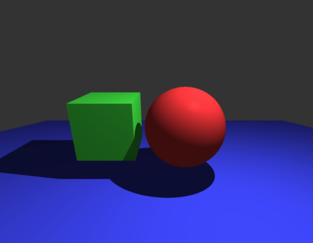

### graphics

A graphics library based on modern OpenGL.

#### Features
- Scene traversal for rendering.
- Nested nodes for grouping or inheriting transformations.
- Implicitly defined surfaces for ray hit testing & multi-threaded ray casting.
- Multi-light shading.
